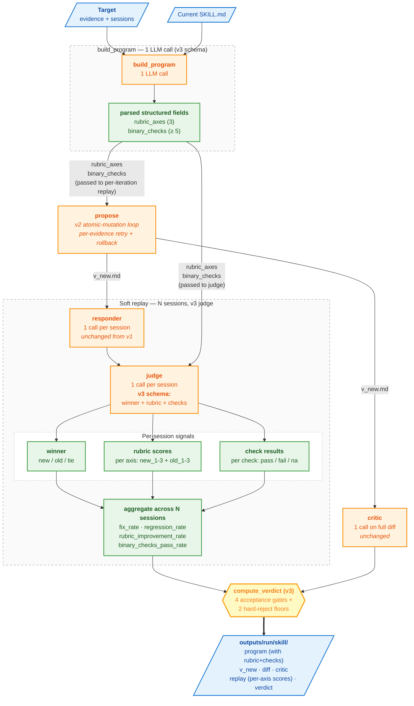

# Strategy v3 — rubric + binary checks

v3 keeps v2's atomic-mutation propose loop and adds **structured
quality scoring** to the validation step. The program LLM emits a
3-axis rubric and ≥5 binary invariants alongside the strategy doc;
the judge scores each replay session against those, and the verdict
combines four aggregate rates instead of v1/v2's two.

The motivation: v1/v2's `<winner>new/old/tie</winner>` is a coarse
signal — it tells you *whether* the new reply is better, not *how*.
A new prompt might "win" because it found the right restaurant but
"lose" because it took an extra step. v3 separates those: the
rubric grades quality on multiple axes, the binary checks assert
invariants must-hold-or-fail.

## What's new in v3

| Change | Why |
|---|---|
| **`build_program` emits rubric + binary checks** | Tailored validation criteria per skill, generated from the evidence. The proposer downstream and the judge both see them. |
| **Single-call judge with 3 signals** | `<winner>` + per-axis 1–3 rubric + per-check pass/fail/na. One LLM call, three signals. |
| **4 aggregate rates** | `fix_rate`, `regression_rate`, `rubric_improvement_rate`, `binary_checks_pass_rate` — separates "did improvement happen" from "was anything broken". |
| **4-gate verdict** | All four rates must clear acceptance thresholds for ACCEPT; 2 of them have hard-reject floors below which the verdict is REJECT. |

`propose` (atomic-mutation), `critic`, `responder` are unchanged
from v2 / v1.

## Flow

The diagram below shows the pipeline for **one skill** (one `Target`).
The orchestrator (`run_pipeline → run_target × N`) iterates this once
per top-N target — that outer loop isn't drawn here. The atomic-
mutation propose loop (inherited from v2) is collapsed into a single
node since this doc focuses on what's new in v3.



## The four rates explained

For each replay session the judge produces three signals. We
aggregate across sessions:

| Rate | Numerator | Denominator |
|---|---|---|
| `fix_rate` | sessions where `winner == "new"` | fix sessions only |
| `regression_rate` | sessions where `winner ∈ {"new", "tie"}` | baselines only |
| `rubric_improvement_rate` | sessions where rubric improved (fix) or didn't regress (baseline) | all sessions |
| `binary_checks_pass_rate` | sessions where every check is pass or na | all sessions |

"Rubric improved" on a fix session = `avg(new axes) > avg(old axes)`.
"Rubric didn't regress" on a baseline = `avg(new) >= avg(old)`.

## Verdict thresholds

```python
THRESHOLDS = {
    # Acceptance — ALL four must clear for ACCEPT
    "fix_rate_min":              0.50,
    "regression_rate_min":       0.90,
    "rubric_improvement_min":    0.70,
    "binary_checks_min":         0.95,

    # Hard reject if either falls below
    "fix_rate_floor":            0.30,
    "binary_checks_floor":       0.80,
}
```

| Outcome | Conditions |
|---|---|
| `ACCEPT` | All 4 rates ≥ their `_min` and critic APPROVE |
| `REJECT` | `fix_rate < 30%` OR `binary_checks < 80%` OR critic REQUEST_CHANGES |
| `HUMAN_REVIEW` | Anything between (above hard-reject floors but below all 4 acceptance gates) |
| `SKIP` | propose returned skip |

## program.md schema (v3)

In addition to v1/v2's sections, `build_program` emits:

```
## Rubric — 3 axes, scored 1–3
- **dietary_constraint_handling**: <one sentence: what excellent looks like>
- **query_specificity**:           <one sentence>
- **result_grounding**:            <one sentence>

## Binary checks — invariants the new prompt must preserve
- [ ] Does the agent always pass user-stated dietary preferences as the filter argument?
- [ ] Does the agent never recommend a result contradicting a stated dietary preference?
- [ ] Does the agent never refuse a reasonable lookup with 'check Yelp'?
- [ ] Does the agent always call search_restaurants for restaurant lookups?
- [ ] Does the agent never recommend a restaurant not in the tool output?
```

These get parsed into `RubricAxis` and `BinaryCheck` dataclasses on
`ProgramResult` and threaded through to every judge call.

## judge response schema (v3)

```xml
<winner>new|old|tie</winner>
<rubric>
  <axis><name>dietary_constraint_handling</name><new>3</new><old>1</old></axis>
  <axis><name>query_specificity</name><new>3</new><old>2</old></axis>
  <axis><name>result_grounding</name><new>2</new><old>2</old></axis>
</rubric>
<checks>
  <check><id>1</id><result>pass</result></check>
  <check><id>2</id><result>pass</result></check>
  <check><id>3</id><result>na</result></check>
  <check><id>4</id><result>pass</result></check>
  <check><id>5</id><result>pass</result></check>
</checks>
<reasoning>...</reasoning>
```

Defensive parsing: missing axes default to 2/2 (no signal either
way); missing checks default to `fail` (regression-safe).

## Cost

| | Per call | Per target (typical) |
|---|---:|---:|
| v3 program | ~$0.03 | $0.03 |
| v3 propose (atomic, ~5 evidence × 1 attempt) | ~$0.025 each | ~$0.13 |
| critic (per attempt + final + canonical) | ~$0.01 each | ~$0.07 |
| replay (1.3× v1 due to longer judge prompt) | ~$0.02 each | ~$0.20 |

Total typical: **~$0.30 per target**, ~4× v1 cost. Worst case ~$0.50.

## When v3 is the right choice

- **Quality-graded improvements.** You want to know "did dietary
  handling specifically improve, or was it a wash?" — rubric scoring
  gives you that signal.
- **Strict invariants.** Your skills have rules that must always
  hold (no PII leaks, no hallucinated tools, no refusals on
  reasonable requests). Binary checks make those failures visible.
- **More confident accepts.** Four gates that all must pass means
  fewer false ACCEPTs at the cost of more HUMAN_REVIEWs. Conservative
  by design.

## When v3 might be overkill

- **Tiny eval datasets.** With only 1–2 fix sessions per target, the
  4 rates are noisy — `binary_checks_pass_rate=100%` over 1 session
  doesn't say much. Stick with v1 or v2 until you have ≥ 5 sessions
  per target.
- **Cost-sensitive runs.** v3 is ~4× v1. If you don't need
  per-axis signal, v2 catches most of the same regressions for ~2×.
