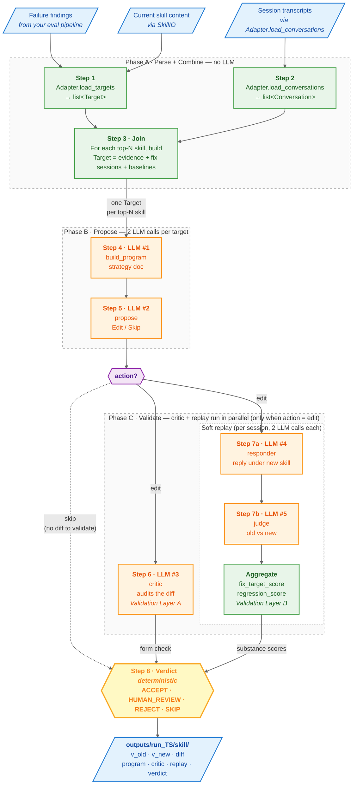

# Pipeline architecture

This document explains how autoresearch turns one day's worth of
agent-evaluation findings into validated skill-edit proposals. The
[README](../README.md) is the 5-minute version; this is the deep dive.

If you only read one section, read [The 8 steps](#the-8-steps) — it
covers what each LLM call does and why we split them.

---

## Where autoresearch sits in your loop

You probably already have an evaluation pipeline that runs daily (or
hourly, or per-PR) and produces signal about agent failures. That
signal lives in some shape — markdown reports, database rows, JSON
dumps, Braintrust scores, whatever.

autoresearch is downstream of that. It reads your eval output through
an [adapter](./writing_an_adapter.md), proposes targeted edits to the
skill prompts that broke, and writes the proposals to disk for human
review. It never touches your skills directory directly.

```
┌──────────────────────────────────────────┐
│  YOUR EVAL PIPELINE                      │
│  (Braintrust / GCP Logs / custom DB)     │
│                                          │
│  produces failure findings + transcripts │
└──────────────────┬───────────────────────┘
                   │
                   │  via your Adapter
                   ▼
┌──────────────────────────────────────────┐
│  AUTORESEARCH                            │
│                                          │
│  parses → targets → proposes → validates │
│  → writes verdicts to outputs/           │
└──────────────────┬───────────────────────┘
                   │
                   │  human reviews diff.txt + verdict.md
                   │  copies approved v_new.md → skills/
                   ▼
            (your normal PR flow)
```

Two boundaries kept deliberately strict:

- **autoresearch does not write to your skills directory.** Approved
  diffs land in `outputs/` only. You merge via your normal review
  process.
- **autoresearch does not run your eval pipeline.** It consumes a
  point-in-time snapshot. Re-running tomorrow tells you whether
  yesterday's accepted edit actually moved the score.

---

## Inputs

Your adapter provides three things to the pipeline:

| Input | Shape | Source |
|---|---|---|
| **Skills** | A way to read & write skill prompt files | Your `skills/` directory, an S3 bucket, a DB — whatever |
| **Targets** | One per skill the pipeline should consider — name, current content, evidence of failure, lists of failing & passing session IDs | Your eval pipeline's findings |
| **Conversations** | Session transcripts (turns + tool calls) keyed by session ID | Your log/transcript store |

The library defines neutral data classes (`Target`, `Conversation`,
`Evidence`, `SkillIO`); your adapter populates them from whatever
your system actually has. See [`writing_an_adapter.md`](./writing_an_adapter.md).

---

## The 8 steps

Grouped into three phases. **Phase A** is pure Python (no LLM calls);
**Phases B and C** are where the model spend lives.



> **Color key** — 🟢 green: pure Python (no LLM). 🟠 orange: LLM call. 🔵 blue: I/O. 🟡 yellow: deterministic verdict. 🟣 purple: action gate.
>
> **Reading the action gate.** After step 5, the proposer's `action` decides what runs next:
> - `edit` (thick double-arrow) — produces a new SKILL.md and fans out into **both** critic and replay, which run independently in parallel.
> - `skip` (dotted arrow) — bypasses both validation gates and goes straight to the verdict (which becomes `SKIP`).

### Phase A · Parse + Combine (no LLM)

#### Step 1 — Parse adapter output

Your `Adapter.load_targets()` returns a list of `Target` objects.
Each target carries:
- `skill_name` — identifier
- `evidence: list[Evidence]` — your findings, free-form structured data
- `fix_session_ids: list[str]` — sessions where the skill failed
- `regression_baseline_ids: list[str]` — sessions where it worked

#### Step 2 — Load conversations

`Adapter.load_conversations()` returns the `Conversation` objects
that step 7 will replay against. Loaded once per run, looked up by
ID per target.

#### Step 3 — Build per-target bundles

For each top-N target the user asked for, the library combines:
- the eng/UX evidence from your adapter
- the conversation transcripts for fix sessions + baseline sessions
- the skill's current content (loaded via `SkillIO`)

into one self-contained `Target` bundle that downstream steps work
with. This is the join step.

### Phase B · Propose (2 LLM calls per target)

#### Step 4 — `build_program` (LLM call #1)

**Input**: target + current SKILL.md + evidence (full)
**Output**: a `program.md` strategy document — which failure pattern
to target, evidence cited inline, current skill state, proposed edit
shape, and what NOT to change.

#### Step 5 — `propose` (LLM call #2)

**Input**: current SKILL.md + program.md
**Output**: an action — `edit` or `skip` — plus the new SKILL.md
content if editing. The prompt enforces minimum-edit discipline:
don't rewrite unrelated sections, don't add generic best-practice
padding, preserve structure and terminology.

The two actions:
- **`edit`** — modify the existing SKILL.md (the common case)
- **`skip`** — don't propose a change at all (strategy too weak, or
  doesn't fit the existing skill cleanly)

**The action determines what runs next:**

- `edit` → both validation gates in Phase C run in parallel (steps 6
  and 7 — neither depends on the other)
- `skip` → both gates are bypassed; the run goes straight to step 8
  with verdict `SKIP`

> autoresearch is fundamentally an *improvement loop on something
> that already exists*. Skill discovery — finding patterns where no
> skill applies and a new one is needed — is upstream of this
> pipeline (in your eval system's attribution layer), not part of it.

### Phase C · Validation (3 LLM calls)

#### Step 6 — `critic` (LLM call #3) — Validation Layer A

**Input**: program.md + the diff produced by step 5
**Output**: `APPROVE` or `REQUEST_CHANGES` with line-by-line concerns.

Independent auditor, different system prompt, different mental frame.
Catches form problems the proposer rationalized — over-editing,
generic padding, structural rewrites that go beyond the strategy.

The propose-then-critic split exists for the same reason code review
exists: the author is biased to approve their own work. Two model
calls with different framing get you genuinely independent judgment.

#### Step 7 — Soft replay — Validation Layer B

For each session in `target.fix_session_ids + regression_baseline_ids`:

- **Responder** (LLM call #4) — receives the full session
  transcript with one focus turn marked, plus the new SKILL.md.
  Outputs the agent reply it would produce at the focus turn under
  the new skill.
- **Judge** (LLM call #5) — receives the same transcript, the
  original agent reply at the focus turn, the responder's
  hypothetical new reply, and the program.md. Picks `new`, `old`, or
  `tie` with reasoning.

Aggregate scores:
- **`fix_target_score`** — % of fix sessions where `new` won
- **`regression_score`** — % of baseline sessions where `new` won OR tied

The focus turn is picked from the eval finding's evidence (most
findings tag a specific turn where things went wrong). For findings
without a turn signal, the last turn of the session is used — that's
where the agent's final user-visible reply lives.

**This is "soft" replay, not real replay.** The responder is one LLM
imagining what another would do, judged by a third. It catches
obvious wins and clear regressions. It cannot run real tools or see
what real APIs would return — for that, your eval pipeline tomorrow
is the ground truth.

### Step 8 — Verdict (deterministic — no LLM)

Five possible labels:

| Verdict | When |
|---|---|
| `ACCEPT` | Critic = APPROVE **AND** `fix_target_score ≥ 70%` **AND** `regression_score ≥ 90%` |
| `HUMAN_REVIEW` | Critic = APPROVE, no hard rejects fired, scores between thresholds |
| `REJECT` | Critic = REQUEST_CHANGES **OR** `fix_target_score < 50%` **OR** `regression_score < 90%` |
| `SKIP` | Step 5 returned `skip` — proposer chose not to attempt an edit |

Thresholds are defined in [`agent_autoresearch/verdict.py`](../agent_autoresearch/verdict.py)
under `THRESHOLDS`. Conservative on purpose: burden of proof is on
the new skill. After 5–10 real runs, tune to taste.

---

## Output structure

One folder per target under each run:

```
outputs/
└── run_<timestamp>/
    ├── summary.md                    ← top-level table across all targets
    └── <skill_name>/
        ├── program.md                ← step 4 output
        ├── propose_reasoning.md      ← step 5: why this edit
        ├── v_old.md                  ← original SKILL.md (snapshot)
        ├── v_new.md                  ← proposed SKILL.md
        ├── diff.txt                  ← unified diff
        ├── critic.md                 ← step 6 verdict + concerns
        ├── replay.md                 ← step 7 per-session results
        └── verdict.md                ← step 8 final label + reasoning
```

Skip targets get a smaller folder: `program.md`, `skip.md`,
`verdict.md` only — no edit was attempted, so no diff/critic/replay.

The folder is **self-contained**: a reviewer opens one folder and sees
strategy → diff → critic → replay → verdict in order, without bouncing
back to your source repo.

---

## Cost model

Per top-N target:

| Phase | Calls | Approx cost |
|---|---|---|
| Step 4 program | 1 | ~$0.02 |
| Step 5 propose | 1 | ~$0.03 |
| Step 6 critic | 1 | ~$0.01 |
| Step 7 replay | 2 × ~3-10 sessions | ~$0.05–0.40 |
| **Total** | ~5-25 calls | **~$0.10–0.50** |

Top-3 targets per run with 3 fix + 3 baseline replays each: **~$1
per autoresearch run**. Trivial vs the cost of one bad skill edit
shipped in production.

Costs assume Sonnet 4.5 (`claude-sonnet-4-5-20250929`). With Haiku for
the critic + judge calls (`claude-haiku-4-5-...`), full-run cost drops
to ~$0.25–0.40. Configurable per-step in
[`agent_autoresearch/strategies/v1.py`](../agent_autoresearch/strategies/v1.py).

---

## Honest caveats

These limitations are real, named here so you know what you're getting.

### Validation is LLM-grading-LLM

The replay step (step 7) generates and compares hypothetical agent
replies using LLMs. It catches form problems the critic missed and
detects clear behavioral changes between old/new skills, but it
cannot:

- Run real tools (no API calls, no DB queries)
- Observe what real users would actually say in the next turn
- Detect failures that emerge from token-level model behavior
  differences

The real ground truth is your eval pipeline running tomorrow against
real production data. Treat autoresearch's verdicts as "probably
worth shipping" rather than "definitely correct."

### Single-focus-turn replay

Replay regenerates the agent's reply at one turn (picked from the
eval finding's evidence, or last turn as fallback). Earlier turns
are kept verbatim from the original session. This means:

- Multi-turn corrections (user clarifies at turn 2, agent fails at
  turn 5) are partially captured: the focus turn is replayed correctly
  but later turns aren't simulated.
- Bug patterns that emerge only across many turns may not surface.

True multi-turn replay (simulating both user and agent across all
turns) is on the v0.4 roadmap. The complexity-vs-fidelity tradeoff is
why we punted to v0.x.

### Run-to-run variance

The proposer LLM doesn't always produce identical edits across runs
on identical input. Same skill, same evidence — sometimes you get a
+50-char minimum edit (clean ACCEPT), sometimes a +300-char broader
edit (HUMAN_REVIEW or REJECT on regression).

This is a feature, not a bug — exploration over different proposal
shapes. If you need determinism, run twice and pick the smallest
ACCEPTed edit.

### Conservative thresholds

Defaults err toward HUMAN_REVIEW rather than ACCEPT. We'd rather have
a real human eyeball a borderline edit than auto-merge an over-edit.
Loosen if you find yourself overriding too many HUMAN_REVIEWs to
ACCEPT manually.

---

## Tuning

Three knobs you'll touch in practice:

| Knob | Where | Default |
|---|---|---|
| `fix_target_min` (ACCEPT bar for fix score) | `verdict.py::THRESHOLDS` | 0.70 |
| `regression_min` (ACCEPT bar for regression score) | `verdict.py::THRESHOLDS` | 0.90 |
| `top_n` (skills to target per run) | CLI flag `--top-n` | 3 |

Less commonly:
- Per-call models (Sonnet vs Haiku) in `strategies/v1.py`
- Replay sample sizes via `--fix-sample` / `--baseline-sample`
- Token caps per LLM call in the same file

---

## What's deliberately NOT in the pipeline

- **No auto-merge.** Approved edits stay in `outputs/`. Human review
  before they land in your skills repo.
- **No DB writes.** autoresearch reads only. State doesn't persist
  between runs (no memory of yesterday's verdicts).
- **No re-fetching from your eval source.** The adapter provides a
  point-in-time snapshot; autoresearch never connects back to query
  more.
- **No assembly + triage layers.** Those happened in your eval
  pipeline upstream. autoresearch starts from "we already have
  findings."

---

## Future work

The big-ticket items:

- **Multi-strategy A/B testing** — run `v1` and `v2` on the same
  target, compare proposed edits side by side
- **Cross-run dedupe** — if yesterday's verdict was REJECT on skill X,
  don't propose the same edit shape today
- **Multi-turn replay** — simulate the full conversation under the
  new skill, including the user's reactions
- **Multi-LLM-provider** — drop-in OpenAI / Bedrock / OpenRouter
  alongside Anthropic
