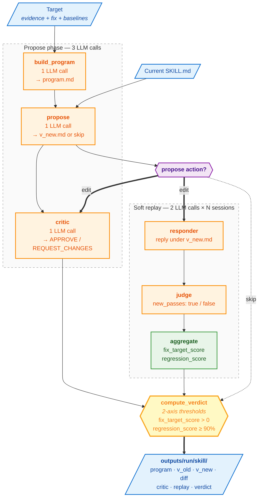

# Strategy v1 — the original autoresearch loop

The simplest version: one bundled edit per skill, one critic pass on
the full diff, one soft replay over a small session sample, then a
deterministic verdict.

This is the right starting point if you've never run autoresearch on
your data — the output is easy to read and the failure modes are
obvious.

## What's in v1

| Stage | LLM calls | Output |
|---|---:|---|
| `build_program` | 1 | `program.md` — strategy doc |
| `propose` | 1 | One bundled `v_new.md` (or `<action>skip</action>`) |
| `critic` | 1 | `<verdict>APPROVE / REQUEST_CHANGES</verdict>` |
| `responder` (per session) | 1 × N | hypothetical reply under the new skill |
| `judge` (per session) | 1 × N | `<new_passes>true / false</new_passes>` |
| `compute_verdict` | 0 | One of `ACCEPT / HUMAN_REVIEW / REJECT / SKIP` |

Total per target with default `fix_sample=3, baseline_sample=3`:
**3 + 12 = 15 LLM calls** ≈ $0.07 with Sonnet 4.5.

## Flow



## Metrics

Each metric is computed over a specific population, with a per-session
boolean from the judge (`new_passes`). There is **no comparison vs the
old reply** — the judge evaluates the new reply on its own merit.

| Metric | Population | Per-session signal | Aggregate |
|---|---|---|---|
| `fix_target_score` | fix sessions (already failed under old) | `new_passes` | fraction of fix sessions where new passes |
| `regression_score` | baseline sessions (already passed under old) | `new_passes` | fraction of baseline sessions where new passes |

## Verdict thresholds

```python
THRESHOLDS = {
    "fix_target_min":   0.0,   # strict `>` — any improvement counts
    "regression_min":   0.9,   # ≥ 90% of baselines must still pass
}
```

| Outcome | Conditions |
|---|---|
| `ACCEPT` | critic APPROVE AND `fix_target_score > 0` AND `regression_score ≥ 0.9` |
| `REJECT` | critic REQUEST_CHANGES OR `regression_score < 0.9` |
| `HUMAN_REVIEW` | critic APPROVE, regression OK, but `fix_target_score == 0` |
| `SKIP` | propose returned skip |

## When v1 is the right choice

- **First-time runs.** You're trying autoresearch on your eval data
  for the first time. Read v1 outputs, make sure the propose stage
  produces edits that look reasonable, then graduate to v2/v3.
- **Cost-sensitive runs.** Quick top-N sweeps where you mainly care
  about which skills *might* benefit from edits, less about
  surgical change quality.
- **Debugging adapters.** When you suspect your adapter is the
  problem (wrong evidence, wrong session IDs), v1's simpler flow
  produces cleaner failure messages.

## When to graduate

- **Multi-issue skills.** v1 bundles all evidence into one proposed
  edit. If your skills have 3+ distinct failure modes, the diffs get
  sprawling and hard to review. → use v2 for per-evidence atomic
  changes.
- **Need invariant signal.** "Did the dietary-filter fix help on its
  own?" can't be answered in v1 (one edit either passes or fails as a
  whole). → v3 with per-axis rubric votes + binary checks.
