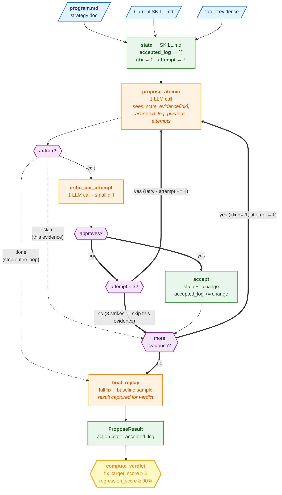

# Strategy v2 — atomic-mutation propose

v2 keeps v1's metrics, replay, and verdict logic — but replaces the
single-shot `propose` with an **atomic-mutation loop**: one change
per evidence, validated by a per-attempt critic, with the survivors
stacked into the final state.

The motivation: v1 bundles every evidence item into a single edit.
When that edit fails, it's hard to tell which part is the problem —
maybe 3 of the 5 changes are good and 2 are bad, but the whole diff
gets rejected. v2 makes each evidence its own atomic mutation with
its own critic gate, then assembles the survivors.

## What's new in v2

| Change | Why |
|---|---|
| **One atomic edit per `propose` LLM call** | Smaller diffs are easier for the critic to evaluate. Each call has a single, scoped purpose. |
| **Per-evidence retry budget** (max 3 attempts) | If the LLM produces a bad edit, the next attempt sees the failure reason and tries a different angle. |
| **Per-attempt critic gate** | Each accepted change is critic-validated before being added to the cumulative state. |
| **`<action>done</action>` early-exit** | The proposer can signal "no more useful edits" mid-loop. |
| **One final replay over the cumulative state** | Result is captured for verdict — orchestrator does **not** re-run replay. |
| **No final critic, no rollback** | Per-attempt critics already validated each accepted change. If an evidence's 3 attempts all fail, it's skipped — previously-accepted changes stand. |

Critic prompt, replay prompt, and verdict logic are unchanged from
v1. Only `propose.py` (and how the orchestrator wires it) is
different.

## Flow



## Metrics & verdict — same as v1

| Metric | Population | Per-session signal | Aggregate | Threshold |
|---|---|---|---|---|
| `fix_target_score` | fix sessions | `new_passes` | fraction where new passes | strict `> 0` |
| `regression_score` | baseline sessions | `new_passes` | fraction where new passes | `≥ 0.90` |

```python
THRESHOLDS = {
    "fix_target_min":   0.0,   # strict `>` — any improvement counts
    "regression_min":   0.9,
}
```

Verdict labels are identical to v1:

| Outcome | Conditions |
|---|---|
| `ACCEPT` | `fix_target_score > 0` AND `regression_score ≥ 0.9` |
| `REJECT` | `regression_score < 0.9` |
| `HUMAN_REVIEW` | regression OK but `fix_target_score == 0` |
| `SKIP` | propose returned skip (no accepted changes) |

**No critic gate at verdict time.** Per-attempt critics already
validated each accepted change inside `propose`; the orchestrator
passes `critic_result=None` to `compute_verdict`. There is no
`critic.md` artifact for v2.

## LLM call count

For E evidence (default), all accepted on first try, `fix_sample=3,
baseline_sample=3`:

| Stage | Calls |
|---|---|
| `build_program` | 1 |
| Per evidence: `propose_atomic` + `critic_per_attempt` | 2 × E |
| `final_replay` (responder + judge × 6 sessions) | 12 |
| **Total** | **2E + 13** |

Worst case adds up to 2 retries per evidence (3 attempts × 2 calls
each). No final critic, no rollback re-runs.

## Public contract

`propose()` still returns one `ProposeResult` with the cumulative
`new_skill_md`. v2 adds two informational fields:

- `accepted_log: list[AtomicAttempt]` — one entry per accepted change
- `attempts_log: list[AtomicAttempt]` — every attempt, accepted or not

Neither affects verdict logic; they're for the markdown trace and
debugging.

## When v2 is the right choice

- **Skills with multiple distinct failure modes.** v1 bundles them
  all into one diff; v2 keeps each evidence's change separable and
  individually critic-validated.
- **You care about attribution.** Each accepted change has its own
  reasoning + the evidence it targets, logged in `accepted_log`.
- **You want recoverable failures.** A bad edit doesn't kill the
  whole run — the loop just moves to the next evidence.

## When to use v3 instead

v2 still uses a single `new_passes` boolean per session — same shape
as v1. If you need **per-axis quality signal** ("the new prompt is
better at dietary handling but worse at result grounding") or
**invariant assertions** ("the new prompt must never refuse a
reasonable lookup"), use v3.
