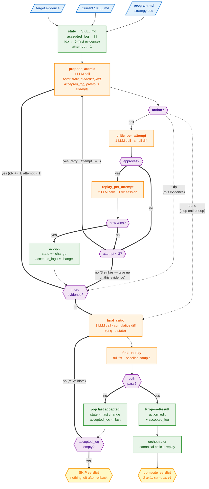

# Strategy v2 — atomic-mutation propose

v2 keeps everything from v1 — same `build_program`, same `critic`,
same `judge`, same 2-axis verdict — but rewrites the `propose` stage
to make **one atomic change at a time**, validate it, then iterate.

The motivation: v1 bundles every evidence item into a single edit.
When that edit fails, it's hard to tell which part is the problem
— maybe 3 of the 5 changes are good and 2 are bad, but the whole
diff gets rejected. v2 fixes this by making each evidence its own
mutation with its own gates, then assembling the survivors.

## What's new in v2

| Change | Why |
|---|---|
| **One atomic edit per `propose` LLM call** | Smaller diffs are easier for critic/judge to evaluate. Each call has a single, scoped purpose. |
| **Per-evidence retry budget** (max 3 attempts) | If the LLM produces a bad edit, the next attempt sees the failure reason and tries a different angle. |
| **Per-iteration gates** (critic + 1-session replay) | Each accepted change is individually validated before moving on. |
| **Final combined check + recursive rollback** | After all accepted changes are stacked, run full critic + replay on the whole bundle. If it fails, drop the most recent change and re-validate; repeat until passing or stack empty. |
| **`<action>done</action>` early-exit** | The proposer can signal "no more useful edits" mid-loop. |

Critic, replay, and verdict are unchanged — same prompts, same
thresholds, same verdict labels. Only `propose.py` and its prompt
are different.

## Flow

The diagram below shows the pipeline for **one skill** (one `Target`).
The "for each evidence" loop iterates over **that skill's** evidence
list (`target.evidence`). The outer "for each top-N target" loop
happens at the orchestrator level (`run_pipeline → run_target × N`)
and isn't drawn here.

## What "validation per attempt" actually means

Each iteration's gates wrap the strategy's own real `critic()` and
`soft_replay()` — same prompts, same parsers — but the **scope is
narrower**:

- `critic_per_attempt` runs on the small per-iteration diff (just
  what changed in *this* atomic step), not the cumulative diff.
- `replay_per_attempt` runs on **one** fix session — the one tied to
  the evidence the LLM is addressing (`evidence.details.session_id`),
  with `fix_sample=1, baseline_sample=0`.

These are cheap gates that catch obvious failures fast. The
**final pass** is what runs the full critic + full sample replay
to make the accept decision.

## Cost

| | LLM calls | $ (Sonnet 4.5) |
|---|---:|---:|
| v1 baseline | ~15 | ~$0.07 |
| v2 happy path (5 evidence × 1 attempt avg) | ~32 | ~$0.16 |
| v2 worst case (8 evidence × 3 retries) | ~80 | ~$0.40 |

## Public contract — unchanged

`propose()` still returns one `ProposeResult` with the final
`new_skill_md`. Downstream stages (critic, replay, verdict at the
orchestrator level) don't change. v2 ProposeResult adds two
informational fields:

- `accepted_log: list[AtomicAttempt]` — one entry per accepted change
- `attempts_log: list[AtomicAttempt]` — every attempt, accepted or not
- `combined_check_passed: bool`

These don't affect verdict logic; they're for the markdown trace and
debugging.

## When v2 is the right choice

- **Skills with multiple distinct failure modes.** v1 bundles them
  all into one diff; v2 keeps them separable.
- **You care about attribution.** Each accepted change has its own
  reasoning + the evidence it targets, logged in `accepted_log`.
- **You want recoverable failures.** A bad edit doesn't kill the
  whole run — the loop just moves to the next evidence.

## When to use v3 instead

v2 still uses v1's freeform `<winner>` judge output and 2-axis
verdict. If you need **graded per-axis signal** ("the new prompt is
clearly better at dietary handling but slightly worse at result
grounding") or **invariant assertions** ("the new prompt must never
refuse a reasonable lookup"), use v3.
