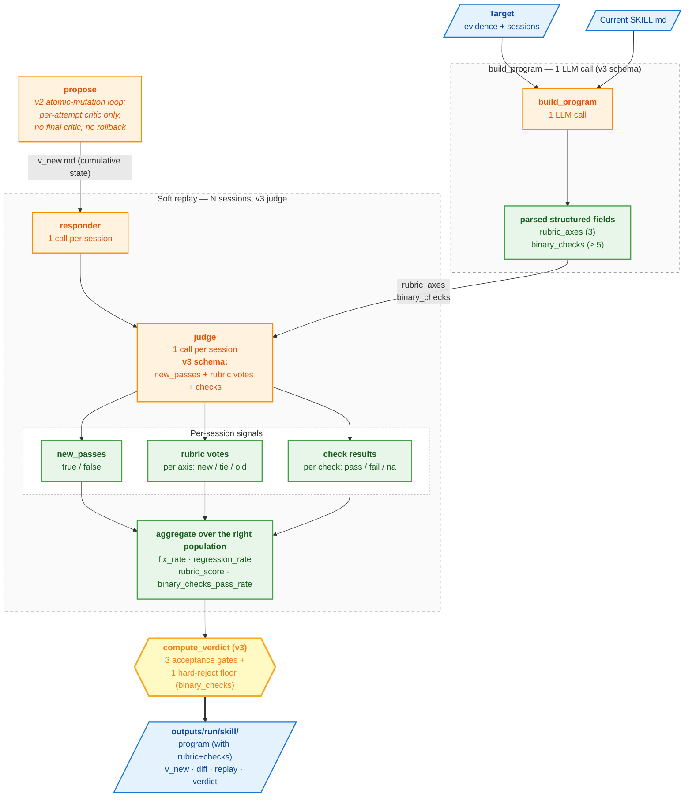

# Strategy v3 — rubric + binary checks

v3 keeps v2's atomic-mutation propose loop and adds **structured
quality scoring** to the validation step. The program LLM emits a
3-axis rubric and ≥5 binary invariants alongside the strategy doc;
the judge produces three signals per session (new_passes + per-axis
winner + per-check pass/fail); the verdict combines four aggregate
metrics instead of v1/v2's two.

The motivation: v1/v2's single `new_passes` boolean tells you
*whether* the new reply clears the bar — not *why*. A new prompt
might pass overall but quietly drop the dietary-filter behavior,
or break a structural invariant. v3 separates those signals: rubric
votes grade per-axis quality on the failing sessions, binary checks
assert must-hold invariants on the passing baselines.

## What's new in v3

| Change | Why |
|---|---|
| **`build_program` emits rubric + binary checks** | Tailored validation criteria per skill, generated from the evidence. Threaded through to every judge call. |
| **Single-call judge with 3 signals** | `<new_passes>` + per-axis `<winner>` + per-check pass/fail/na. One LLM call, three signals. |
| **4 aggregate metrics with population-specific scopes** | Each metric is computed over the population where it makes sense (see below). |
| **3-gate verdict + binary-checks reject floor** | regression + binary_checks + rubric_score all gate ACCEPT; `binary_checks < 80%` is the only hard REJECT path. |

`propose` (atomic-mutation), the per-attempt critic, and the
responder are unchanged from v2. Like v2, there is no final critic
call and no rollback.

## Flow



## The four metrics

Each one is aggregated over a specific population — judge signals
that don't fit that population are simply not counted.

| Metric | Population | Per-session signal | Aggregate | Threshold |
|---|---|---|---|---|
| `fix_rate` | fix sessions | `new_passes` (bool) | fraction passing | informational (no gate) |
| `regression_rate` | baseline sessions | `new_passes` (bool) | fraction passing | `≥ 0.90` |
| `binary_checks_pass_rate` | **baseline** sessions × checks | per-check `pass / fail / na` | fraction of (session, check) pairs passing (`na` counts as pass) | `≥ 0.90`; hard-reject if `< 0.80` |
| `rubric_score` | **fix** sessions × axes | per-axis winner: `new=+1`, `tie=0`, `old=-1` | mean over (session × axis) pairs, range `[-1, +1]` | `≥ 0` |

### Why these populations

- **Fix sessions** already failed under the old skill, so checking
  whether old "did better" is meaningless. We just want to know if
  the new reply passes (`fix_rate`) and whether it tilts the rubric
  toward improvement (`rubric_score`).
- **Baseline sessions** already passed under the old skill. We need
  the new prompt to also pass (`regression_rate`) and to not break
  any must-hold invariants (`binary_checks_pass_rate`).

## Verdict thresholds

```python
THRESHOLDS = {
    "fix_rate_min":           0.0,    # informational only — always passes
    "regression_rate_min":    0.90,   # over baseline sessions
    "binary_checks_min":      0.90,   # over baseline × check pairs
    "rubric_score_min":       0.0,    # mean +1/0/-1 over fix × axis pairs
    "binary_checks_floor":    0.80,   # hard REJECT below this
}
```

| Outcome | Conditions |
|---|---|
| `ACCEPT` | `regression_rate ≥ 0.90` AND `binary_checks_pass_rate ≥ 0.90` AND `rubric_score ≥ 0` |
| `REJECT` | `binary_checks_pass_rate < 0.80` |
| `HUMAN_REVIEW` | Anything between (above hard-reject floor, below at least one acceptance gate) |
| `SKIP` | propose returned skip |

**No critic gate at verdict time.** Like v2, per-attempt critics
validate each accepted change inside `propose`; the orchestrator
passes `critic_result=None` to `compute_verdict`. No `critic.md`
artifact for v3.

## `program.md` schema (v3)

In addition to v1/v2's sections, `build_program` emits:

```
## Rubric — 3 axes
- **dietary_constraint_handling**: <one sentence: what excellent looks like>
- **query_specificity**:           <one sentence>
- **result_grounding**:            <one sentence>

## Binary checks — invariants the new prompt must preserve
- [ ] Does the agent always pass user-stated dietary preferences as the filter argument?
- [ ] Does the agent never recommend a result contradicting a stated dietary preference?
- [ ] Does the agent never refuse a reasonable lookup with 'check Yelp'?
- [ ] Does the agent always call search_restaurants for restaurant lookups?
- [ ] Does the agent never recommend a restaurant not in the tool output?
```

Parsed into `RubricAxis` and `BinaryCheck` dataclasses on
`ProgramResult` and threaded through to every judge call.

## judge response schema (v3)

```xml
<new_passes>true|false</new_passes>
<rubric>
  <axis><name>dietary_constraint_handling</name><winner>new</winner></axis>
  <axis><name>query_specificity</name><winner>tie</winner></axis>
  <axis><name>result_grounding</name><winner>new</winner></axis>
</rubric>
<checks>
  <check><id>1</id><result>pass</result></check>
  <check><id>2</id><result>pass</result></check>
  <check><id>3</id><result>na</result></check>
  <check><id>4</id><result>pass</result></check>
  <check><id>5</id><result>pass</result></check>
</checks>
<reasoning>...</reasoning>
```

Defensive parsing:
- Missing `new_passes` → `false` (don't optimistically count a parse miss as a pass)
- Missing axes → `tie` (score 0, neutral)
- Missing checks → `fail` (regression-safe default)

## LLM call count

For E evidence (default), all accepted on first try, `fix_sample=3,
baseline_sample=3`:

| Stage | Calls |
|---|---|
| `build_program` (v3 — emits rubric + checks) | 1 |
| Per evidence: `propose_atomic` + `critic_per_attempt` | 2 × E |
| `final_replay` (responder + v3 judge × 6 sessions) | 12 |
| **Total** | **2E + 13** |

Same call count as v2. The v3 judge prompt is longer (3 signals) so
each judge call is ~1.3× the cost of v2's, but the call count is
identical.

## When v3 is the right choice

- **Quality-graded improvements.** You want to know "did dietary
  handling specifically improve, or was it a wash?" — per-axis
  rubric votes give you that signal.
- **Strict invariants.** Your skills have rules that must always
  hold on previously-passing sessions (no PII leaks, no hallucinated
  tools, no refusals on reasonable requests). Binary checks make
  those failures visible.
- **More confident accepts.** Three rate gates that all must pass +
  one hard-reject floor means fewer false ACCEPTs at the cost of
  more HUMAN_REVIEWs. Conservative by design.

## When v3 might be overkill

- **Tiny eval datasets.** With only 1–2 fix sessions per target, the
  rubric/checks rates are noisy. Stick with v1 or v2 until you have
  ≥ 5 sessions per target.
- **You don't need per-axis or invariant signal.** v2 catches most
  of the same regressions with simpler output. v3's marginal value
  is the rubric votes and binary checks — if those don't tell you
  anything new on your data, stay on v2.
